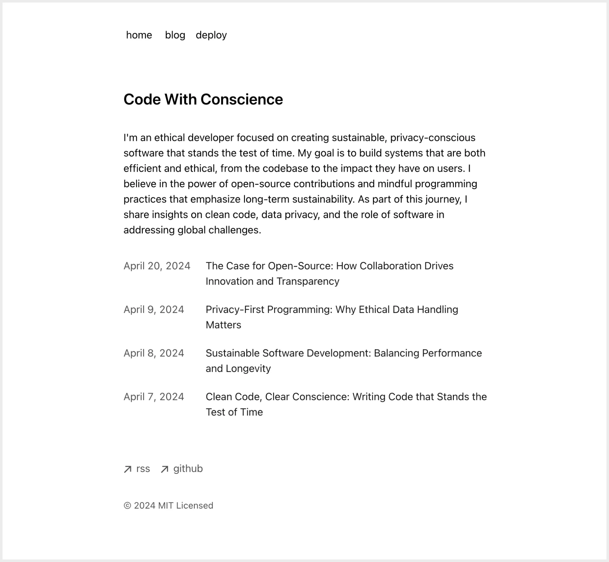

# Stubby CMS | Next.js Minimal Blog Starter

This is a portfolio site template complete with a blog, built with Next.js and Stubby CMS. It includes various features to help you get started quickly.

This is a portfolio site template complete with a blog. Includes:

- MDX and Markdown support with Stubby CMS
- Optimized for SEO (sitemap, robots, JSON-LD schema)
- RSS Feed
- Dynamic OG images
- Syntax highlighting
- Tailwind v4

## Demo



Check out the live demo: [Stubby Starter Minimal Blog](https://stubby-starter-blog.vercel.app/)

## Getting Started

1. **Clone the repository:**

    ```bash
    git clone git@github.com:stubbycms/starter-minimal-blog.git
    cd starter-minimal-blog
    yarn install 
    ```
2. **Configuration:**

    Environment Variables Copy .env.example to .env.local and update the variables as needed.

    Goto [stubby.io](https://stubby.io) or your own self hosted version of stubby get the site_id and api key and update them in your .env.local file. 

    ```sh
    STUBBY_API_KEY=your_stubby_api_key
    STUBBY_SITE_ID=your_stubby_site_id
    ```
    Make sure you add all your content on the root without any folders. 
3. **Run dev server**

    Then you run the dev server with the following command. 

    ```bash
    yarn dev
    ```

## Other notes

* If you want to add your own components you can do that by updating the /app/components/mdx.tsx file.
* Tailwind CSS is configured in tailwind.config.js. You can customize it according to your needs.
* TypeScript configuration is in tsconfig.json. Adjust the settings as required.

## Contributing
Contributions are welcome! Please open an issue or submit a pull request.

## License
This project is licensed under the MIT License.